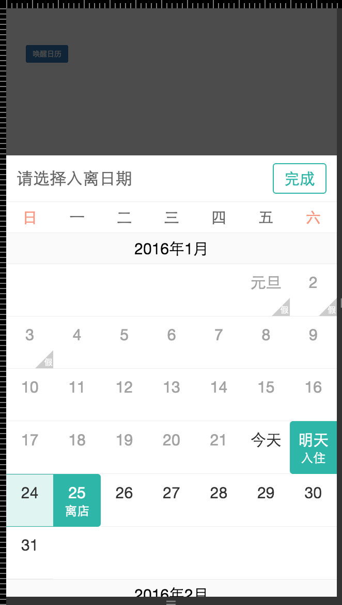

# vue-component-calendar

[](https://david-dm.org/vuejs/vue-loader-example)
[](https://david-dm.org/vuejs/vue-loader-example#info=devDependencies)

> Example using [vue-loader](https://github.com/vuejs/vue-loader) with [Webpack](http://webpack.github.io).

相关操作

```
# demo
双击打开`example/browser.html`

# serve with hot reload at localhost:8080 => 开发
npm run dev

# build for production with minification => 打包编译
npm run build

# prepub
gulp prepub

# publish
gulp publish
```

For detailed explanation on how things work, read the [docs for vue-laoder](http://vuejs.github.io/vue-loader).

### rem说明：

```
1rem = 100px(iPhone5)
1rem = 117.18px(iPhone6)

```

### 使用方式

```
<body>
    <div class="content">
        <button @click.prevent="showCalendar=true">唤醒日历</button>
        <calendar
            :show-calendar.sync="showCalendar"
            max-date="4m"
            start-date="2016-01-23"
            end-date="2016-01-25"
            :is-double-check.sync=true
            :is-vication.sync=true></calendar>
    </div>
    <script type="text/javascript">
        var ef = new Vue({
            el: '.content',
            data: {
                showCalendar: false,
                result: null
            },
            components: {
                "calendar": vueComCalendar
            },
            events: {
                'vue-calendar-confirm': function(result) {
                    //do whatever you want.
                    console.log(result)
                },
                'vue-calendar-cancle': function(result) {
                    //do nothing
                }
            }
        });
    </script>
</body>
```

### API

##### 展示相关

* `max-date="4m"` or `max-date="90d"`

    * 设置月份的时候，默认到最后一个月的最后一天是可选状态

    * 设置天数的时候，默认到天数的最后一天可选，之前和之后都不可选

* `:is-vication.sync=true`

    * 是否显示假期及假日


##### 操作相关

* `start-date="2016-01-23"`

    * 设置日历默认选中的开始日期，此时默认是支持入住和离店 双选
    * 插件会自动滚动到开始日期


* `end-date="2016-01-25"`

    * 设置日历默认选中的离店日期
    * 注意：如果设置是单选，但是设置了开始和结束时间是只选中开始时间

* `:is-double-check.sync=true`

    * 日历是单选还是双选，文案不同，效果也不同
    * 如果是多选，但是只选择了一个日期，这时候点击完成会有错误提示
        ```
        { status: -1 , msg:"you need selected two dates." }
        ```
* `'events' Method`

    * `vue-calendar-confirm`
        * 点击完成时，会触发该事件，同时回传日期选中结果
    * `vue-calendar-cancle`
        * 点击backdrop区域的时候，会触发该事件，此时会关闭日历，但也同时回传当前的选中日期结果，但是这时候一般不会对数据做处理，当做取消操作。


##相关截图

